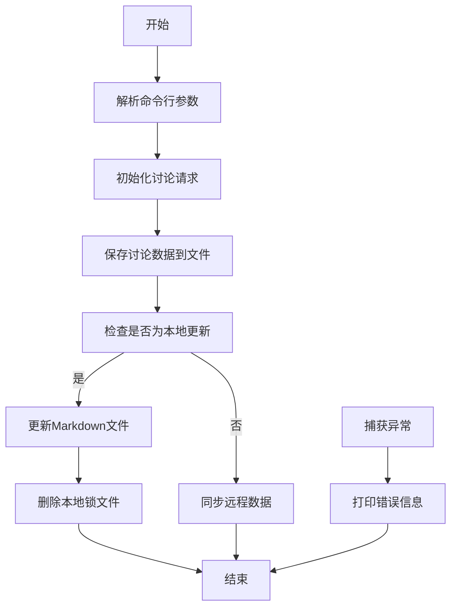

<!-- name: blog_notes -->

## 使用的框架与主题

在之前几年时间里，折腾过`Hexo`，`Hugo`，甚至还开发过相关的插件，搞过不同的留言系统，也搞过不同的相册，但是最后还是打算回归简洁。在自建服务器到期了之后，因为也没有其他使用服务器的需求，又回归了Github，使用`Mkdocs`。

使用的框架是[mkdocs-material](https://squidfunk.github.io/mkdocs-material/)，相关的配置可以参考文档。

## 遇到的问题与解决方案

### 使用Github actions进行部署

为了能够实现这个效果，需要创建一个`deploy.yml`文件，然后启用`Actions`，使用Github actions进行部署。

```yml
name: deploy 
on:
  push:
    branches:
      - main
  schedule:
    - cron: '0 0 * * 2,4,6'

jobs:
  deploy:
    runs-on: ubuntu-latest

    steps:
      - name: Check branch
        uses: actions/checkout@v4
      
      - name: Git config
        run: |
          git config --global user.name <username>
          git config --global user.email <email>
        run: git pull

      - name: Setup python
        uses: actions/setup-python@v5
        with:
          python-version: '3.13'
    
      - name: Install requirements
        run: pip install -r requirements.txt

        # ...

      - name: Save build cache
        uses: actions/cache/save@v4
        with:
          key: mkdocs-material-${{ hashfiles('.cache/**') }}
          path: .cache

      - run: mkdocs gh-deploy --force
```

通过上面的配置，就能做到两个触发条件：

1. 当`main`分支有更新时，就会触发部署；
2. 每周二、周四、周六的0点触发部署（格林威治时间）。

### Github discussions更新逻辑

这一块是整个博客的灵魂，使用Github discussions进行文章编写主要有以下两个原因：

1. 不局限于编写的地点，可以跨平台，比如在手机上写文章，或者使用其他编辑器
2. Github相对比较稳定，不会受到不同平台之间切换的影响

那么，重点就是如何将Github discussions与mkdocs中的Markdown文章进行关联，这里我主要借助了[GitHub GraphQL API](https://docs.github.com/zh/graphql)和[MkDocs api](https://www.mkdocs.org/dev-guide/api/)进行实现。在最初的版本中，采用了[维燕的知识花园](https://weiyan.cc/)使用的方案，但是后来由于分类对应复杂的原因，我重构了整个文章映射的逻辑，现在无论使用Github discussions还是本地编辑器，都能够进行文章的更新。



在deploy.yml中，我编写了一个`deploy.py`脚本，用来实现上面流程图中的功能，核心功能如下所示

```yml
# ...
      - name: Convert markdown posts or github discussions
        run: |
          python overrides/deploy_scripts/deploy.py \
            -r jygzyc/notes \
            -t ${{ secrets.PERSONAL_NOTE_ACCESS_TOKEN }} \
            -o docs
# ...
```

```python
discussion_converter = DiscussionConverter(discussions_data=discussions_data, out_dir=out_dir)
if discussion_converter.local_lock:
    for md_file in out_dir.rglob("*.md"):
        discussion_request.update_discussion(md_file)
    # Path("discussions").unlink()
    Path(out_dir).joinpath("local.lock").unlink()
else:
    discussion_converter.sync_remote()
```

那么，我们分别来看怎么实现更新机制，首先我们来看远端更新，因为如果本地需要更新，则要拉取远端的数据与本地进行匹配，这样能够减少需要更新的次数；无需本地更新的话，就是直接远端拉取更新了

首先，`overrides\deploy_scripts\src\discussion_graphql.py`中存储了所有需要构造的GraphQL查询语句，当`overrides\deploy_scripts\src\discussion_request.py`中需要执行相应的语句时调用即可。而`discussion_request`初始化时就会调用`query_discussions`获取到远端最新的discussions数据，这一点可以下面的代码中看到

```python
class DiscussionRequest:

    discussions_data: dict

    def __init__(self, github_repo: str, github_token: str):
        # ...
        self.discussions_data = self.query_discussions()
    
    def query_discussions(self) -> dict:
        # ...
        while has_next_page:
            query = DiscussionGraphql.make_query_discussions(
                # ...
            )
            results = self._request(query).get("data", "").get("repository", "").get("discussions", "")
            #  ...
            all_discussions.extend(temp_discussion)
        # ...
        discussions_with_timestamp = {'date': str(beijing_time), 'nodes': all_discussions}
        print(f"[*] Query {self.gh_repo} discussions successfully!")
        return discussions_with_timestamp
```

之后，当输出端docs文件夹下存在`local.lock`文件时，则需要更新Markdown文件，否则直接远端拉取更新即可


### Github discussions 文章分类与生成

这一部分是整个博客代码重构时最烧脑的，如何在仅仅使用Github discussions的前提下，能做到文章分类与标签能够自动化生成，着实让我想了好久。不过，最终还是找到了一个相对妥协的方案：

- 使用Categories进行文章一级与二级的分类
- 使用Label进行文章三级的分类
- 新增number字段关联唯一标识discussion的url
- 使用slug生成文章的url
- 新增字段控制草稿和评论是否生成

可能听上面的描述还是有点抽象了，我们直接来看看代码吧

#### 文章生成

首先来看看`overrides\deploy_scripts\src\discussion_converter.py`中的`DiscussionConverter`类，这就是实现上述功能的核心代码，下面我们分功能说明：

- 文件名生成：我们其实可以获取到每一个discussion的title，但是由于如果标题是中文，会经过URL编码，导致整个URL过长；所以我在这里规定了一个标准注释，即文章头部的`<!-- name: filename -->`，这样就能避免文件名过长的问题了；如果没有这个注释，则会使用`python-slugify`处理标题生成文件名（中文会转为拼音）

```python
def md_filename_generator(self, discussion: dict):
    discussion_body = discussion["body"]
    pattern = r'<!--\s*name:\s*([^\s]+)\s*-->'

    for line in discussion_body.splitlines()[:10]:
        match = re.search(pattern, line)
        if match:
            filename = match.group(1)
            break
    else:
        filename = f'{slugify(discussion["title"], allow_unicode=False, lowercase=True)}'
    return f'{filename}.md'
```

- 文件路径生成：为了摆脱原先使用固定路径配置，标签冗余过长的问题，我使用了Category和Label来生成路径。其中，
  - Category为一级分类，直接使用category的description生成路径，例如，“Android专栏”对应的描述为`technology.android`，那么生成的Markdown文件就会在`docs/technology/android/`下
  - Label为二级分类，使用label的description生成路径，例如，“Android Geek”对应的描述为`technology.android.geek`，那么生成的Markdown文件就会在`docs/technology/android/geek/`下
  - 如果Label存在且description包含Category的description，则优先以label的description作为路径，否则以category的description作为路径，上面两条结合起来就是一个很好的例子

```python
def md_directory_path_generator(self, discussion: dict):
    discussion_category_description = discussion['category']['description']
    # use discussion_category_description as path
    result = self._path_preprocess(discussion_category_description)
    for node in discussion['labels']['nodes']:
        label_description = node['description']
        if self._is_label_draft(label_description) or \
            self._is_label_locked(label_description):
            continue
        if label_description.find(discussion_category_description) != -1:
            # use label_description as path
            result = self._path_preprocess(label_description)
    return result
```

- 文件metadata生成：根据之前生成的路径，判断文件属于根目录的站点页面、博客文章还是普通页面，分别生成不同的metadata，并根据一些自定义的Label决定文章是否为草稿，评论区是否开放等等

```python
    def md_meta_generator(self, discussion: dict, md_name, md_path):
        is_comment_open = "true"
        is_draft = "false"
        label_list = []

        for node in discussion['labels']['nodes']:
            label_name = node['name']
            label_description = node['description'].strip()
            if self._is_label_draft(label_description):
                is_draft = "true"
                continue
            elif self._is_label_locked(label_description):
                is_comment_open = "false"
                continue
            else:
                label_list.append(label_name)

        match md_path:
            case ".":
                metadata = (f'---\n'
                            f'title: {discussion["title"]}\n'
                            f'number: {str(discussion["number"])}\n'
                            f'url: {discussion["url"]}\n'
                            f'authors: [{discussion["author"]["login"]}]\n'
                            f'template: home.html\n'
                            f'draft: {is_draft}\n'
                            f'comments: {is_comment_open}\n'
                            f'---\n\n')
            case "blog/posts/":
                slug = "blog/discussion-{0}".format(discussion["number"])
                metadata = (f'---\n'
                            f'title: {discussion["title"]}\n'
                            f'slug: {slug}/\n'
                            f'number: {str(discussion["number"])}\n'
                            f'url: {discussion["url"]}\n'
                            f'date:\n'
                            f'  created: {discussion["createdAt"][0:10]}\n'
                            f'  updated: {discussion["updatedAt"][0:10]}\n'
                            f'created: {discussion["createdAt"][0:10]}\n'
                            f'updated: {discussion["updatedAt"][0:10]}\n'
                            f'authors: [{author}]\n'
                            f'categories: {label_list}\n' 
                            f'draft: {is_draft}\n'
                            f'comments: {is_comment_open}\n'
                            f'---\n\n')
            case _:
                slug = Path(md_path).joinpath("discussion-{0}".format(discussion["number"]))
                metadata = (f'---\n'
                            f'title: {discussion["title"]}\n'
                            f'slug: {slug}/\n'
                            f'number: {str(discussion["number"])}\n'
                            f'url: {discussion["url"]}\n'
                            f'created: {discussion["createdAt"][0:10]}\n'
                            f'updated: {discussion["updatedAt"][0:10]}\n'
                            f'authors: [{discussion["author"]["login"]}]\n'
                            f'categories: [{discussion["category"]["name"]}]\n'
                            f'labels: {label_list}\n'
                            f'draft: {is_draft}\n'
                            f'comments: {is_comment_open}\n'
                            f'---\n\n')
        return metadata
```

上述三部分都生成之后，就可以组合在一起，形成一个完整的Markdown文件了，下面是核心的组合代码，细节就不多讲了

```python
def file_converter(self, discussion):
    # ...
    md_path = self.md_directory_path_generator(discussion=discussion)
    md_filename = self.md_filename_generator(discussion=discussion)
    md_metadata = self.md_meta_generator(discussion=discussion, md_name=md_filename, md_path=md_path)
    discussion_body = discussion["body"]
    saved_dir = self.out_dir.joinpath(md_path)
    if saved_dir.exists():
        for i in saved_dir.glob(md_filename):
            i.unlink()
    else:
        Path(saved_dir).mkdir(parents=True, exist_ok=True)

    saved_filepath = Path(saved_dir).joinpath(md_filename)
    with open(saved_filepath, "w") as md_file:
        md_file.write(md_metadata)
        md_file.write(discussion_body)
```

#### 确认导航

尽管已经生成了Markdown文件，但是在MkDocs中，还是需要手动添加到`mkdocs.yml`中才能够显示出来，这里我使用了``

```python
```