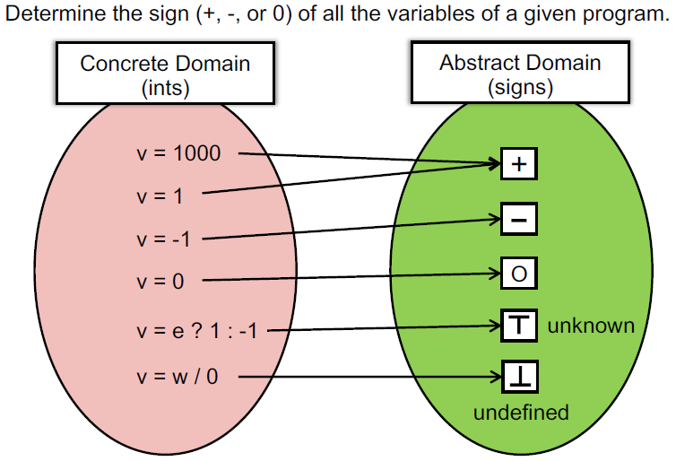
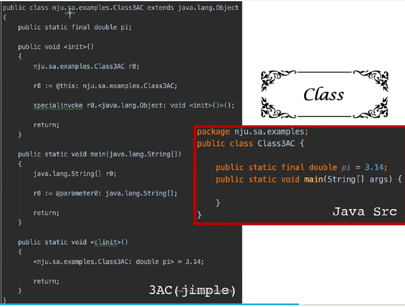
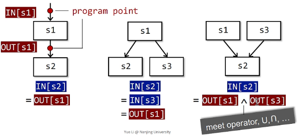
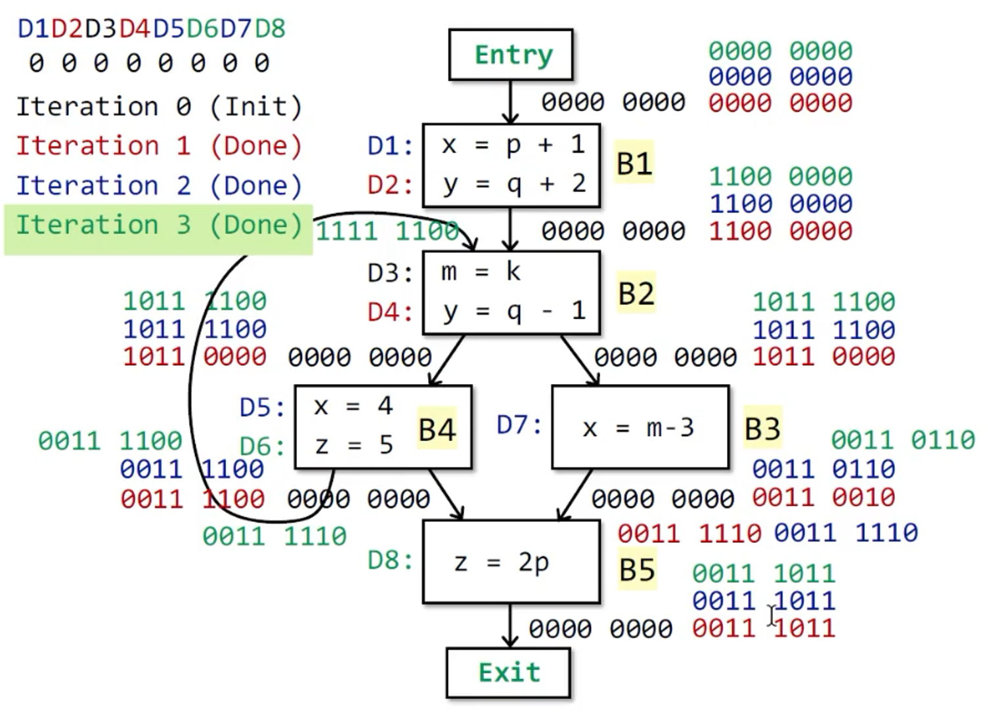

# 静态程序分析笔记


## 1 Introduction

静态分析是程序语言中的一个细分分支


- 语言的分类：命令式 (C, Java)、函数式 (Scala, Haskell)、逻辑式/声明式
- 挑战：语言没有变，但是程序变复杂了，如何保证可靠
- 静态分析的用途：程序可靠性、程序安全、编译优化、程序理解

### sound & complete

- Rice’s Theorem: Any non-trivial property of the behavior of programs in a r.e. language is undecidable.
  - non-trivial properties ~= interesting properties ~= the properties related with run-time behaviors of programs
  - r.e. (recursively enumerable) 递归可枚举语言: recognizable by a Turing-machine
  - There is no such approach to determine whether P satisfies such non-trivial properties, i.e., giving exact answer: Yes or No
  - 故不存在 perfect (sound & complete) static analysis

- sound & complete


  - Over- and under-approximations are both for safety of analysis
  - sound: 报出所有问题 may analysis: outputs information that may be true (over-approximation) (safe=over)
  - complete: 报出的问题都是对的 must analysis: outputs information that must be true (under-approximation) (safe=under)

- useful static analysis

  - 妥协 soundness (false negatives 可能漏报)
  - 妥协 completeness (false positives 可能误报) (大多数情况的分析，因为 soundness 很重要) 几乎所有的静态分析都需要sound，比如用于验证优化等


### Static Analysis 静态分析

- 静态分析：**Static analysis** analyzes a program P to reason about its behaviors and determines whether it satisfies some properties before running P.

- 一句话概括静态分析：Static Analysis: ensure (or get close to) soundness, while making good trade-offs between analysis precision and analysis speed. 在保证正确性的前提下，在精度和速度上做平衡。

- 两个词概括静态分析：Abstraction, Safe-approximation
  - Abstraction: 具体值->符号值



  - Over-approximation
    - Transfer functions : 在抽象值上的操作


    
    虽然静态分析有用，但是有可能造成误报

- Control flows 所有程序汇聚的点，都需要merge


## 2 Intermediate Representation 中间表示

### Compilers and Static Analyzers

- 编译器


词法分析器（Scanner），结合正则表达式，通过词法分析（Lexical Analysis）将 source code 翻译为 token。

语法分析器（Parser），结合上下文无关文法（Context-Free Grammar），通过语法分析（Syntax Analysis），将 token 解析为抽象语法树（Abstract Syntax Tree, AST）

语义分析器（Type Checker），结合属性文法（Attribute Grammar），通过语义分析（Semantic Analysis），将 AST 解析为 decorated AST

Translator，将 decorated AST 翻译为生成三地址码这样的中间表示形式（Intermediate Representation, IR），并**基于 IR 做静态分析**（例如代码优化这样的工作）。

Code Generator，将 IR 转换为机器代码。

有人要问了，为什么不直接拿 source code 做静态分析？这是因为我们得先确保这是一份合格的代码，然后再进行分析。分析代码合不合格，这是 trivial 的事情，由前面的各种分析器去做就行了，我们要做的是 non-trivial 的事情。

### AST vs. IR

为什么静态分析时，使用IR而不是AST呢？


- AST 是 high-level 且接近语法结构的，而 IR 是 low-level 且接近机器代码的。

- AST 是依赖于语言的，IR 通常是独立于语言的：三地址码会被分析器重点关注，因为可以将各种前端语言统一翻译成同一种 IR 再加以优化。

- AST 适合快速类型检查，IR 的结构更加紧凑和统一：在 AST 中包含了很多非终结符所占用的结点（body, assign 等），而 IR 中不会需要到这些信息。

- AST 缺少控制流信息，IR 包含了控制流信息：AST 中只是有结点表明了这是一个 do-while 结构，但是无法看出控制流信息；而 IR 中的 goto 等信息可以轻易看出控制流。

因此 IR 更适合作为静态分析的基础。

### IR： Three-Address Code 三地址码

三地址码（3-Address Code）通常没有统一和标准的格式。在每个指令的右边至多有一个操作符。


三地址码为什么叫做三地址码呢？因为每条 3AC 至多有三个地址。而一个「地址」可以是：

- 名称 Name: a, b
- 常量 Constant: 3
- 编译器生成的临时变量 Compiler-generated Temporary: t1, t2

常见的 3AC 包括：

- x = y *bop* z：双目运算并赋值，bop = binary operator
- x = *uop* z：单目运算并赋值，uop = unary operator
- x = y：直接赋值
- *goto* L：无条件跳转，L = label
- if x goto L：条件跳转
- if x *rop* y goto L：包含了关系运算的条件跳转，rop = relational operator

### Soot and Its IR: Jimple

#### For Loop

 ```java
 package ecool.examples;
 public class ForLoop3AC{
     public static void main(String[] args){
         int x = 0;
         for(int i = 0; i < 10; i++){
             x = x + 1;
         }
     }
 }
 ```


#### Do-While Loop

```java
package ecool.examples;
public class DoWhileLoop3AC{
    public static void main(String[] args){
        int[] arr = new int [10];
        int i = 0;
        do{
            i = i + 1;
        }while (arr[i] < 10);
    }
}
```


#### Method Call

```java
package ecool.examples;
public class MethodCall3AC{
    String foo(String para1, String para2) {
        return para1 + " " + para2;
    }
    
    public static void main(String[] args){
        MethodCall3AC mc = new MethodCall3AC();
        String result = mc.foo("hello", "world");
    }
}
```


invokespecial: call constructor,  call superclass methods, call private methods

invokevirtual：instance methods  call (virtual dispatch)

invokeinterface: cannnot optimization, checking interface implementation

invokestatic：call static methods


Java 7: invokedynamic -> Java static typing , dynamic language runs on JVM

method signature: class name: return type method name(parameter1 type, parameter2 type, …)


#### Class



### Static Single Assignment(SSA)

所谓静态单赋值（SSA），就是让每次对变量x赋值都重新使用一个新的变量，并在后续使用中选择最新的变量。

```
3AC        | SSA
p = a + b    p1 = a + b
q = p - c    q1 = p1 - c
p = q * d    p2 = q1 * d
q = p + q    q2 = p2 + q1
```

但是这样一来，肯定会因为不同控制流汇入到一个块，导致多个变量备选的问题：


这里解决的办法就是使用一个合并操作符$\phi$（phi-function），根据控制流的信息确定使用哪个变量。

为什么要用 SSA 呢？

- 控制流信息间接地集成到了独特变量名中
  - 如果有些对控制流不敏感的简化分析，就可以借助于 SSA
- 定义与使用是显式的
  - 更有效率的数据存取与传播，有些优化在基于 SSA 时效果更好（例如条件常量传播，全局变量编号等）

为什么不用 SSA 呢？

- SSA 会引入过多的变量和 phi 函数
- 在转换成机器代码时会引入低效率的问题

### Basic Blocks & Control Flow Graphs

控制流分析（Control Flow Analysis）通常指的是构建控制流图（Control Flow Graph, CFG），并以 CFG 作为基础结构进行静态分析的过程。


CFG 的一个结点可以是一条单独的 3AC，但是更常见的是一个基本块（Basic Block）。所谓基本块，就是满足以下性质的连续 3AC：

- 只能从块的第一条指令进入。
- 只能从块的最后一条指令离开。
- 满足条件的最大指令集合


如何构建一个基本块呢？

- 输入：程序 P 的一系列 3AC
- 输出：程序 P 的基本块
- 方法
  1. 决定 P 的 leaders
     - P 的第一条指令就是一个 leader
     - 跳转 jump 的目标指令是一个 leader
     - 跳转指令的后一条指令，也是一个 leader
  2. 构建 P 的基本块
     - 一个基本块就是一个 leader 及其后续直到下一个 leader 前的所有指令。


除了基本块，CFG 中还会有块到块的边。块 A 和块 B 之间有一条边，当且仅当：

- A 的末尾有一条指向了 B 开头的跳转指令。
- A 的末尾紧接着 B 的开头，且 A 的末尾不是一条无条件跳转指令


注意到每个基本块和开头指令的标号唯一对应，因此很自然地，我们可以将跳转指令的目标改为基本块的标号而非指令标号：


- 若 A -> B，则我们说 A 是 B 的前驱（predecessor），B 是 A 的后继（successor）
- 除了构建好的基本块，我们还会额外添加两个结点，「入口（Entry）」和「出口（Exit）」
  - 这两个结点不对应任何 IR
  - 入口有一条边指向 IR 中的第一条指令
  - 如果一个基本块的最后一条指令会让程序离开这段 IR，那么这个基本块就会有一条边指向出口。

这样，我们就完成了一个控制流图的构建：


## 3 Data Flow Analysis

### Overview of Data Flow Analysis

数据流分析的核心：How Data Flows on CFG?

将这句话展开来，所谓数据流分析就是：

```txt
How application-specific Data (对数据的抽象：+, -, 0 等……)
 	Flows (根据分析的类型，做出合适的估算) through the
 		Nodes (数据如何 transfer, 如 + op + = +) and
 		Edges (控制流如何处理，例如两个控制流汇入一个BB) of
 		CFG (整个程序) ?
```

不同的数据流分析，有着不同的data abstraction, flow safe-approximation策略，transfer functions&control-flow handlings。

### Preliminaries of Data Flow Analysis  输入输出状态

#### Input and Output States 输入输出状态

- 每一条IR的执行，都会使状态从**输入状态**变成新的**输出状态**

- 输入/输出状态与语句前/后的 **program point** 相关联。



在数据流分析中，我们会把每一个Program Point关联一个数据流值，代表在该点中可观察到的抽象的程序状态。

#### 关于转移方程约束的概念

前向分析和后向分析


#### 关于控制流约束的概念

每条语句 s 都会使程序状态发生改变。

B 的输出自然是其输入在经过多次转换后得到的状态。

而 B 的输入要根据数据流分析的需求，对其前驱应用合适的 meet operator 进行处理。后向分析时亦然。


------


### Reaching Definitions Analysis 到达定值分析

#### 基本概念

- 假定 x 有定值 d (**definition**)，如果存在一个路径，从紧随 d 的点到达某点 p，并且此路径上面没有 x 的其他定值点，则称 x 的定值 d 到达 (**reaching**) p。

- 如果在这条路径上有对 x 的其它定值，我们说变量 x 的这个定值 d 被杀死 (**killed**) 了


到达定值可以用来分析未定义的变量。例如，我们在程序入口为各变量引入一个 dummy 定值（即未初始化）。当程序出口的某变量定值依然为 dummy，则我们可以认为该变量未被定义。

#### Abstraction 到达定值中的数据流值

程序中所有变量的定值。

可以用一个 bit vector 来定义，有多少个赋值语句，就有多少个位。


#### Safe-approximation 转移方程和控制流

对于一条赋值语句 D: v = x op y，该语句生成了 v 的一个定值 D，并杀死程序中其它对变量 v 定义的定值。


- 从入口状态删除 kill 掉的定值，之后再union加入新生成的定值。


- 任何一个前驱的变量定值都表明，该变量得到了定义。

#### 到达定值算法


这是一个经典的迭代算法。

- 首先让所有BB和入口的OUT为空。因为你不知道 BB 中有哪些定值被生成。（OUT在may analysis情况下一般为空，在must analysis的情况下一般为TOP）
- 当任意 OUT 发生变化，则分析出的定值可能需要继续往下流动，所需要修改各 BB 的 IN 和 OUT。
- 先处理 IN，然后再根据转移完成更新 OUT。
- 在 gen U (IN - kill) 中，kill 与 gen 相关的 bit 不会因为 IN 的改变而发生改变，而其它 bit 又是通过对前驱 OUT 取并得到的，因此其它 bit 不会发生 0 -> 1 的情况。所以，OUT 是不断增长的，而且有上界，因此算法最后必然会停止。
- 因为 OUT 没有变化，不会导致任何的 IN 发生变化，因此 OUT 不变可以作为终止条件。我们称之为程序到达了不动点（Fixed Point）



当没有change发生在OUT中时停止迭代 


## 参考文献

[Static Program Analysis Book (pblo.gq)](https://spa-book.pblo.gq)

[《软件分析》笔记 | Fancy's Blog (fancypei.github.io)](https://fancypei.github.io/SA/)